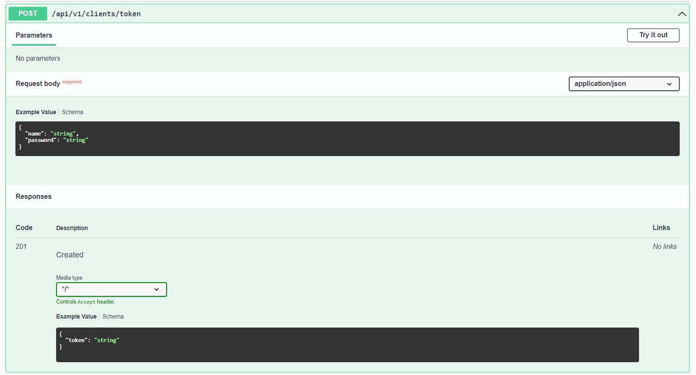
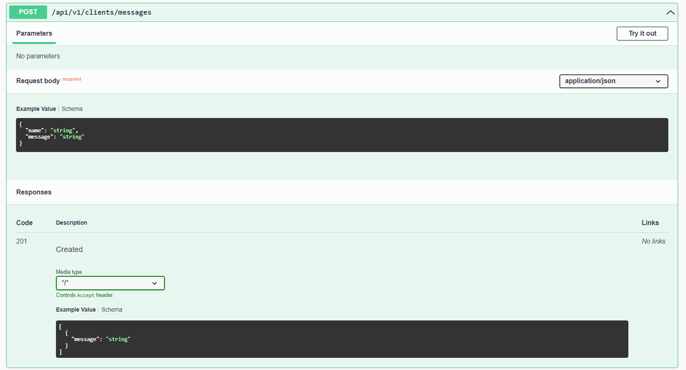

# Token And Message Service

## REST Service, выполняющий следующий функционал:
- Проверка клиента в базе по name и password
- Генерация, проверка наличия и валидация JWT токена
- Сохранение сообщений от клиента
- Вывод списка ранее сохраненных сообщений клиента

## Есть два способа запустить приложение: локально и с помощью Docker.

## Необходимые инструменты для запуска локально❗
1. `JDK 11` - для работы сервиса
2. `Maven` - для сборки проекта
3. `PostgreSQL` - для хранения данных

## Подготовка 🔨
Вам понадобится СУБД PostgreSQL. Отройте pgAdmin и создайте базу данных с названием "inside".

## Запуск проекта
1. Скопируйте проект к себе с помощью git clone.
2. В файле application.yaml добавьте данные для подключения к базе данных (имя пользователя, пароль и URL), если хотите использовать другие.
```java
    spring:
        datasource:
            driver-class-name: org.postgresql.Driver
            username: postgres - имя пользователя PostgreSQL
            password: admin - пароль пользователя PostgreSQL
            url: jdbc:postgresql://localhost:5432/inside - URL для подключения к базе даныых (добавьте порт и адрес, если у Вас другие)

        jpa:
            properties.hibernate:
            show_sql: true
            format_sql: true
            hbm2ddl.auto: validate
            open-in-view: false

        liquibase:
            liquibase-schema: public

        server:
            port: 9000 - порт

        jwt.token:
            secret: insidetesttaskantonnarizhnyjuniorjavadeveloper
            expired: 3600000
```
3. При первом запуске проекта Liquibase создаст все необходимые таблицы в базе данных и добавит в них данные.

## Для работы через Docker❗
Сперва необходимо выполнить команду **./mvnw clean**, после **./mvnw clean package -DskipTests**.
Далее необходимо перейти на мой [Docker Hub](https://hub.docker.com/u/antonnarizhny) и скачать image проекта. 
Команда **docker pull antonnarizhny/test-task-inside_api_service** может измениться в будущем.
Данную команду необходимо ввести в терминал, после чего нужно ввести команду **docker images**, чтобы убедиться, что image скачан.
Следом нужно последовательно ввести команды **docker-compose build** и **docker-compose up**.
Вместе с проектом будет загружен image PostgreSQL. Сервис сам к ней подключится, Liquibase создаст все необходимые таблицы в базе данных и добавит в них данные.

## После сервис можно тестировать с помощью cURL, Swagger, Postman и так далее.
Сервис работает на порту 9000 и к нему следует обращаться по адресу **localhost:9000/_endpoint_**.
Для тестирования доступно 3 сущности Client c полями name и password соответственно:
1. user - 12345
2. anton - 07111998
3. test - 55555

При желании это можно изменить в миграции **db.changelog-2.0.sql**.

Для обращения к эндпоинту /api/v1/clients/token токен не нужен. Нужны только name и password, которые приведены выше.
Bearer токен, полученный из эндпоинта /api/v1/clients/token необходимо указывать в заголовках запроса с ключом Token (между Bearer и токеном должно быть нижнее подчеркивание).

Для получения сообщений из БД сообщение должно быть вида: history (**количество желаемых последних сообщений для получения(тип long)**).

## Эндпоинты сервиса, а также схемы принимаемых и возвращаемых DTO




## cURL для тестирования
Для получения токена через Post эндпоинт /api/v1/clients/token:

curl -X 'POST' \
'http://localhost:9000/api/v1/clients/token' \
-H 'accept: */*' \
-H 'Content-Type: application/json' \
-d '{
"name": "test",
"password": "55555"
}'

Для сохранения сообщения через Post эндпоинт /api/v1/clients/messages:

curl -X 'POST' \
'http://localhost:9000/api/v1/clients/messages' \
-H 'accept: */*' \
-H 'Content-Type: application/json' \
-H 'Token: Bearer_**(токен из первого запроса)**' \
-d '{
"name": "test",
"message": "hello world"
}'

Для получения сообщений из базы данных через Post эндпоинт /api/v1/clients/messages:

curl -X 'POST' \
'http://localhost:9000/api/v1/clients/messages' \
-H 'accept: */*' \
-H 'Content-Type: application/json' \
-H 'Token: Bearer_**(токен из первого запроса)**' \
-d '{
"name": "test",
"message": "history **количество желаемых последних сообщений для получения(тип long)**(history 10)"
}'

### **Технологии, которые были использованы**:
* Java 11
* Spring Framework (Core, Validation, Boot, Web, Data JPA)
* PostgreSQL
* Maven
* Swagger
* Lombok
* Liquibase
* JWT